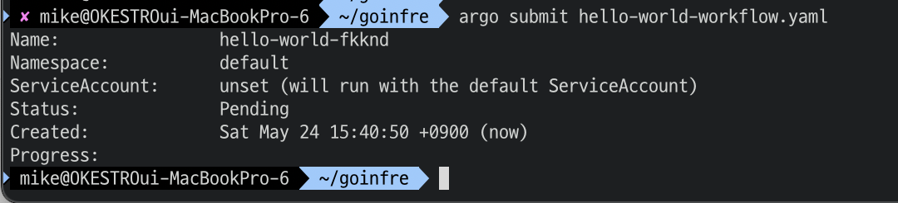

# Running Locally

## 로컬 개발 환경 구성하기

### 1. Git Clone

[argo-workflows repository](https://github.com/argoproj/argo-workflows) 에서 git clone 합니다.

```shell
git clone https://github.com/argoproj/argo-workflows.git
```

### 2. 준비 환경

- Go
- Yarn
- Docker
- protoc
- Node.js for running the UI
- A local Kubernetes cluster (k3d, kind, or minikube)
- The following entries in your /etc/hosts file:

```text
127.0.0.1 dex
127.0.0.1 minio
127.0.0.1 postgres
127.0.0.1 mysql
127.0.0.1 azurite
```

#### A. kind 설치 및 cluster 생성

로컬 k8s 환경을 구축하기 위해서 k3d, kind, minikube 등을 사용할 수 있습니다.  
이번 가이드에서는 kind 를 사용합니다.

```shell
# 1. kind 설치
# 해당 링크 참고 https://kind.sigs.k8s.io/docs/user/quick-start#installing-with-a-package-manager

# 2. kind cluster 생성
$ kind create cluster

# 3. cluster 확인
$ kind get clusters
```

#### B. /etc/hosts 등록하기

/etc/hosts 등록하는 방법

```shell
$ vi /etc/hosts

or

$ sudo vi /etc/hosts
```


### 3. 실행하기

✅ asdf 를 사용하면 node.js 를 못찾는 문제가 존재합니다. nvm 사용을 권장합니다.

준비가 끝났다면 argo-workflows 를 실행해보겠습니다.

```shell
make start UI=true
```

(UI=true 옵션을 사용하면 API=true 도 함께 적용됩니다.)

위와 같은 이미지가 보이면 성공입니다.

실행에 성공한 경우,  
http://localhost:2746 에서 API 를 확인할 수 있습니다.  
http://localhost:8080 로 이동하면 argo-workflows UI 를 확인할 수 있습니다.  

argo-workflows UI 화면

### 4. workflows 만들기

argo-workflows 를 실행했다면 "Hello World" 를 출력하는 workflow 를 만들어보겠습니다.

```yaml
## hello-world-workflow.yaml

apiVersion: argoproj.io/v1alpha1
kind: Workflow # new type of k8s spec
metadata:
  generateName: hello-world- # name of the workflow spec
spec:
  entrypoint: hello-world # invoke the hello-world template
  templates:
    - name: hello-world # name of the template
      container:
        image: busybox
        command: [echo]
        args: ["Hello World"]
        resources: # limit the resources
          limits:
            memory: 32Mi
            cpu: 100m
```

위와 같은 workflow manifest 를 생성합니다.

#### via CLI

```shell
$ argo submit hello-workflow.yaml
```


정상적으로 생성되었다면 확인해봅시다.

```shell
$ argo list
$ argo logs @latest
```


Hello World 가 출력된 것을 확인할 수 있습니다.

#### via UI

http://localhost:8080 으로 이동합니다
좌측 상단의 Workflow Templates 메뉴로 이동합니다. (http://localhost:8080/workflow-templates)


1. CREATE NEW WORKFLOW TEMPLATE 를 클릭
2. UPLOAD FILE 클릭
3. 이전에 생성한 workflow manifest 등록
   
4. CREATE 클릭
   

등록한 template 를 정상적뉴로 확인했다면, workflow 를 생성해보겠습니다.
좌측 상단의 Workflows 메뉴로 이동합니다. (http://localhost:8080/workflows)

1. SUBMIT NEW WORKFLOW 클릭
2. Select a workflow template 클릭
3. 이전에 등록한 template 선택
   
4. SUBMIT 클릭
   

### 참고

1. [공식문서](https://argo-workflows.readthedocs.io/en/latest/running-locally/#manual-installation)
