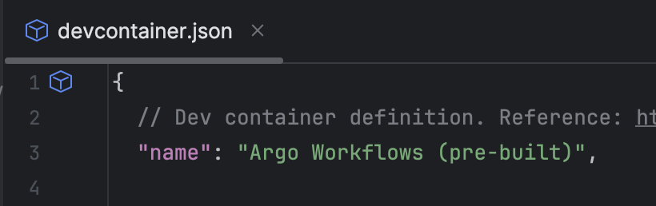

# Dev Container 사용하여 개발 환경 구축하기

* Dev Container 를 사용하여 손쉽게 개발 환경을 구축하는 방법을 가이드합니다.
* Visual Studio Code 또는 Goland 를 사용하는 것을 전제로 가이드합니다.

## 1. 리포지토리 클론

* argo-workflows 리포지토리를 로컬 환경에 클론합니다.
* 예시:
  ```shell
  git clone https://github.com/argoproj/argo-workflows.git
  ```
* 개발 및 기여를 위해 argo-workflows 리포지토리를 자신의 GitHub 계정에 Fork 한 경우 해당 리포지토리를 클론합니다.

## 2. 필요한 개발 도구 준비

* Docker 설치 : Docker Desktop 등 자신의 환경에 맞는 방법을 선택하여 설치합니다.
* 에디터/IDE 설치 : 아래 2개 중 하나를 선택하여 설치합니다.
    * Visual Studio Code : 설치 이후 Dev Containers 플러그인(Microsoft 제공)을 설치합니다. 
    * Goland : 유료 IDE 입니다. 결제하여 사용하는 경우 Goland 를 사용하셔도 됩니다.

## 3. Dev Container 실행 

### Visual Studio Code

* 로컬에 클론한 argo-workflows 리포지토리를 엽니다.
* Command Palette 를 엽니다.
* "Dev Containers: Reopen in Container" 메뉴를 선택합니다.
  
* "Argo Workflows (pre-built)" 메뉴를 선택합니다.
  
* Dev Container 내부에서 다시 열린 VSCode 에서 Dev Container 세팅 완료를 확인합니다. ("Done. Press any key to close the terminal." 메시지 확인)
  
* Dev Container 내부에서 다시 열린 VSCode 에서 터미널을 열고 `make clean` 명령어를 실행합니다. (터미널 환경이 `vscode ➜ ~/go/src/github.com/argoproj/argo-workflows` 인 것을 확인합니다.)
  

### Goland

* 로컬에 클론한 argo-workflows 리포지토리를 엽니다.
* `.devcontainer/devcontainer.json` 파일을 엽니다.
* 해당 파일의 좌상단 부분의 아이콘을 클릭합니다.
  
* 처음 Dev Container 를 생성하는 경우 "Create Dev Container and Clone Sources..." 메뉴를 선택하여 새 Dev Container 를 생성하고 접속합니다.
  
  
* 이전에 생성한 Dev Container 가 있는 경우 "Show Dev Containers" 메뉴를 선택하여 기존 Dev Container 중 원하는 것을 선택하여 접속합니다. (컨테이너 이름 부분을 클릭하여 선택할 수 있습니다.)
  
  
* Dev Container 내부에서 다시 열린 Goland 에서 터미널을 열고 `make clean` 명령어를 실행합니다. (터미널 환경이 `vscode ➜ ~/go/src/github.com/argoproj/argo-workflows` 인 것을 확인합니다.)
  

## 4. Argo Workflows 실행

* Dev Container 내부에서 터미널을 열고 아래 명령을 실행합니다.
  ```shell
  make start UI=true
  ```
* 모든 컴포넌트가 실행 완료된 경우 아래 주소에 접속하여 실행 결과를 확인합니다.
    * UI  : http://localhost:8080 
